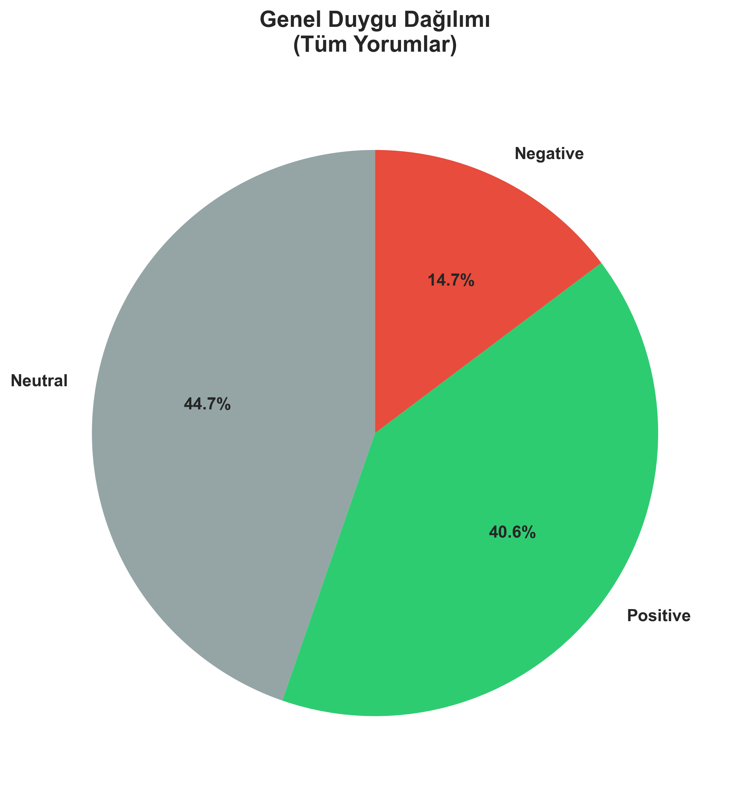
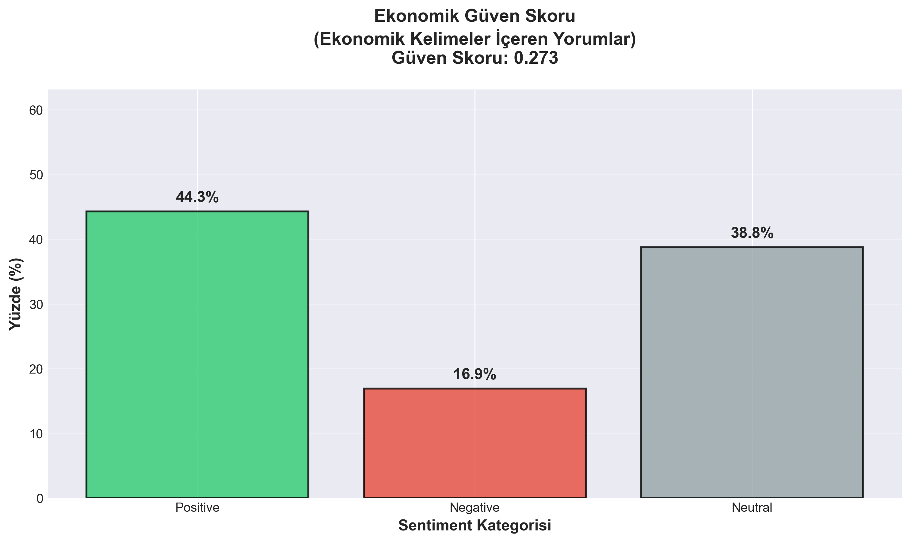
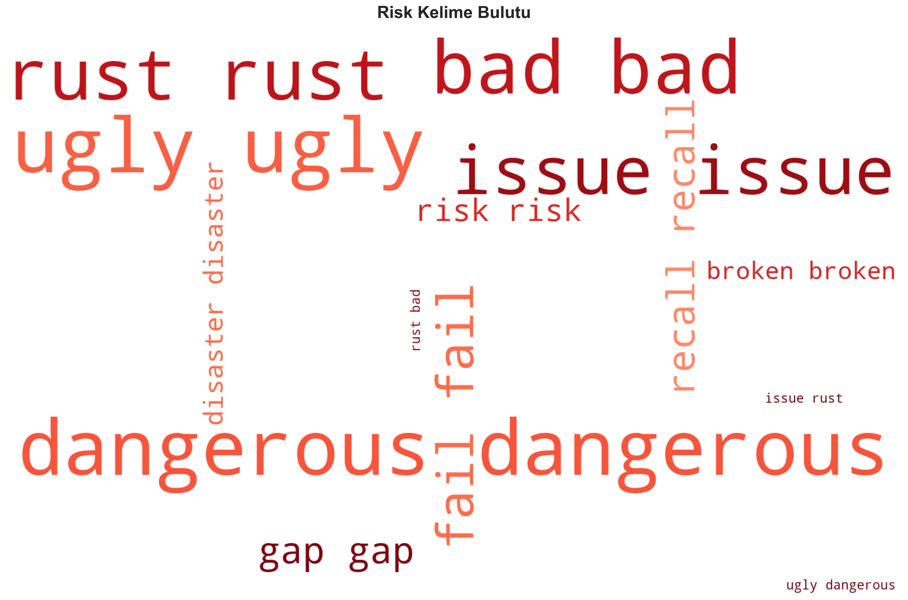
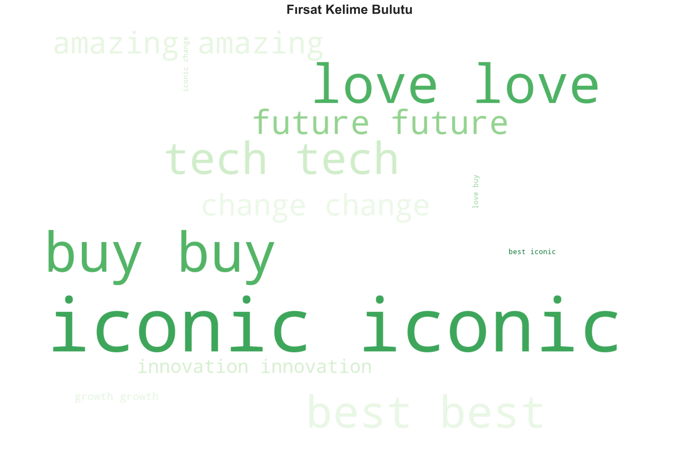

# 📊 Tesla Cybertruck Lansmanı: Pazar Atmosferi ve Tüketici Duygu Analizi
# Rıdvan Yasir Nuhbaşa - 132230033

> **Yönetici Özeti:** Bu proje, Tesla Cybertruck lansmanının dijital pazardaki yansımalarını, **11.000'den fazla** tüketici geri bildirimi üzerinden analiz eden stratejik bir veri madenciliği çalışmasıdır.

---

## 🎯 Projenin Amacı ve Stratejik Hedefler

Bu çalışmanın temel amacı, Tesla Cybertruck'ın lansman sürecinde oluşan pazar atmosferini ölçümlemek ve markanın "kriz" ile "fırsat" arasındaki konumunu veri odaklı olarak belirlemektir. Geleneksel anket yöntemlerinin aksine, bu proje **Büyük Veri (Big Data)** ve **Doğal Dil İşleme (NLP)** tekniklerini kullanarak tüketicilerin filtresiz, organik tepkilerini analiz etmiştir.

Analiz, yönetimsel karar alma süreçlerine ışık tutacak şu üç temel soruya yanıt aramaktadır:
1.  **Ekonomik Güven Endeksi:** Pazar şu an yüksek fiyatlı, radikal bir ürünü kabul etmeye (satın alma iştahına) hazır mı?
2.  **Marka Konumlandırması:** Cybertruck, medyada teknik bir "fiyasko" olarak mı, yoksa devrimsel bir "ikon" olarak mı algılanıyor?
3.  **Risk Yönetimi (Fear Mining):** Potansiyel müşterilerin satın alma kararını engelleyen bilinçaltı korkuları (güvenlik, sosyal dışlanma vb.) nelerdir?

---

## 🛠️ Veri Kaynağı ve Kapsam

Çalışmanın veri seti, ürünün lansman videosu altındaki **11.029** adet tekil kullanıcı yorumundan oluşmaktadır. Veri toplama sürecinde **YouTube Data API v3** kullanılarak "Deep Crawl" yöntemi uygulanmış, sadece ana yorumlar değil, alt yanıtlar (replies) da kapsama dahil edilmiştir.

**Veri İşleme Süreci:**
* **Temizleme (Preprocessing):** Emoji, URL, hashtag ve bot içerikleri regex algoritmaları ile temizlenmiştir.
* **Dil İşleme:** İngilizce dışındaki yorumlar filtrelenmiş, *Stopwords* (etkisiz kelimeler) arındırılmıştır.
* **Tokenizasyon:** Metinler, duygu analizi ve n-gram modellemesi için en küçük anlam birimlerine ayrılmıştır.

---

## 🔬 Yöntem (Metodoloji)

Projede, insan yargısı ile yapay zeka tekniklerini birleştiren **Hibrit Analiz Modeli** kullanılmıştır:

1.  **Duygu Analizi (Sentiment Analysis):** `TextBlob` kütüphanesi ile her yorumun duygu skoru (-1 ila +1) hesaplanmıştır. Kütüphane çıktıları görselleştirilirken, literatüre uygun olarak **Pozitif duygular Yeşil**, **Negatif duygular Kırmızı** ve **Nötr yaklaşımlar Gri** renk kodları ile temsil edilmiştir, böylece karar vericiler için anlık görsel algı kolaylığı sağlanmıştır.
2.  **Korku Madenciliği (Fear Mining):** `NLTK` kütüphanesi kullanılarak *POS Tagging* (Sözcük Türü İşaretleme) yapılmış; "İsim + Sıfat" tamlamaları (Bigrams) üzerinden tüketicilerin spesifik korkuları (Örn: "Crumple zones/Ezilme bölgeleri") tespit edilmiştir.
3.  **Eşdizimlilik Analizi (Co-occurrence):** Marka isminin "Risk" ve "Fırsat" kelime kümeleriyle ne sıklıkla yan yana geldiği istatistiksel olarak ölçülmüştür.

---

## 📊 Analiz Bulguları ve Pazar İçgörüleri

Yapılan analizler sonucunda elde edilen kritik bulgular aşağıdadır:

### 1. Tüketici Güveni ve Ekonomik Algı
**Genel Sentiment Dağılımı:** Tüm yorumlar baz alındığında, tüketici algısı pozitiftir. Yorumların **%40.6'sı Pozitif**, %14.7'si Negatif ve %44.7'si Nötrdür.

**Ekonomik Odaklı Analiz:** Fiyat ve değer odaklı yorumlarda ise pozitif algı daha da yükselmektedir (**%44.3 Pozitif**). Ekonomik güven skoru **0.273** seviyesindedir; bu durum pazarın ürünü bir "lüks tüketim"den ziyade "teknolojik yatırım" olarak gördüğünü kanıtlar.

### 2. Kelime Frekansları ve Marka İmajı
Kullanıcıların kullandığı kelimeler, markanın iki uç arasında gidip geldiğini göstermektedir. **Fırsat odaklı kelimeler (2480 adet)**, risk odaklı kelimelerden (1509 adet) yaklaşık **1.6 kat daha fazla** kullanılmıştır. Bu durum, pazarın genel eğiliminin iyimser olduğunu kanıtlar.

| Kategori | Anahtar Kelimeler (Frekans) | Stratejik Anlamı |
| :--- | :--- | :--- |
| **FIRSAT** | `Future`, `Iconic`, `Innovation`, `Tech` | Marka, otomotiv sektörünün geleceği ve bir "kült objesi" olarak konumlanıyor. |
| **RİSK** | `Gap`, `Rust`, `Broken`, `Issue` | Üretim kalitesi (panel boşlukları, paslanma) marka imajını zedeleyen en büyük teknik risk. |

**Görsel Kanıtlar:**
Aşağıdaki kelime bulutları, tüketicilerin zihnindeki marka çağrışımlarını görselleştirmektedir:

| Risk Algısı (Negatif) | Fırsat Algısı (Pozitif) |
| :---: | :---: |
|  |  |

### 3. Korku Madenciliği (Fear Mining) Sonuçları
Negatif yorumların derinlemesine analizi, tüketicilerin bilinçaltı korkularını ortaya çıkarmıştır. En sık rastlanan endişeler şunlardır:

| Sıra | Korku Teması (Bigram) | Frekans | Algılanan Risk |
| :--- | :--- | :--- | :--- |
| 1 | `pt cruiser` | 21 | Tasarımın "çirkin" veya "demode" bulunması (Sosyal Dışlanma) |
| 2 | `dangerous thing` | 12 | Aracın genel güvenliği ile ilgili belirsizlik |
| 3 | `crumple zones` | 12 | Kaza anında enerjiyi ememeyen sert gövde yapısı |
| 4 | `stainless steel` | 7 | Paslanma ve bakım zorlukları |
| 5 | `pedestrian safety` | 6 | Keskin hatların yayalar için oluşturduğu tehlike |

*Not: "Cyber Truck" ve "Elon Musk" gibi jenerik terimler analiz dışı bırakılmıştır.*

---

## ⚠️ Marka İçin Tespit Edilen Riskler

Analiz sonucunda Tesla için üç ana risk başlığı belirlenmiştir:

1.  **Güvenlik Algısı Yönetimi:** Kullanıcılar, aracın çelik dış iskeletinin kaza güvenliği konusunda geleneksel araçlardan daha zayıf olduğuna inanmaktadır.
2.  **Kalite Kontrol (QC) Sorunları:** "Gap" (Boşluk) ve "Rust" (Pas) kelimelerinin sıklığı, premium bir araçtan beklenen işçilik kalitesinin karşılanmadığını düşündürmektedir.
3.  **Tasarım Kutuplaşması:** Tasarım "Fütüristik" bulunduğu kadar "Çirkin" (Ugly) olarak da etiketlenmektedir. Bu durum, pazar penetrasyonunu niş bir kitleyle sınırlayabilir.

---

## 📢 Yönetici ve Karar Vericiler İçin Özet (Senaryo 4: Medya Algısı Analizi)

Bu bölüm, üst yönetimin (C-Level) karar alma süreçlerinde ihtiyaç duyduğu kritik sorulara doğrudan veri odaklı yanıtlar sunmaktadır:

### ❓ Soru 1: Şu an piyasaya yeni ürün sürmek için doğru bir psikolojik atmosfer (tüketici güveni) var mı?
**YANIT:** ✅ **EVET.**
Analiz sonuçlarına göre Ekonomik Güven Skoru **0.273 (Pozitif)** seviyesindedir. Tüketiciler, yüksek fiyata rağmen ürünü bir "lüks harcaması" olarak değil, "geleceğe yatırım" olarak görmektedir. Pazarın satın alma iştahı yüksektir.

### ❓ Soru 2: Markamız medyada "kriz/risk" ile mi yoksa "fırsat/büyüme" ile mi anılıyor?
**YANIT:** 📈 **FIRSAT/BÜYÜME.**
Marka, "Fırsat" kelime kümeleriyle (2480 frekans), "Risk" kelime kümelerine (1509 frekans) kıyasla **1.6 kat daha fazla** yan yana gelmektedir. Medya algısında "İnovasyon", "Teknoloji" ve "İkonik" kavramları baskındır; bu da markanın bir kriz içinde değil, büyüme evresinde olduğunu kanıtlar.

### ❓ Soru 3: Halkın gündemindeki ana korku ne ve biz bunu nasıl güvene dönüştürebiliriz?
**YANIT:** 🛡️ **GÜVENLİK VE SOSYAL KABUL.**
En büyük korku "Crumple Zones" (Ezilme Bölgeleri) eksikliği ve tasarımın sosyal çevrede alay konusu olmasıdır (`pt cruiser`).
* **Çözüm:** Reklamlarda "sağlamlık" vurgusu yerine, enerjiyi nasıl dağıttığını gösteren simülasyonlar (NCAP testleri) kullanılmalıdır. Tasarım ise "herkes için değil, vizyonerler için" sloganıyla bir statü sembolüne dönüştürülmelidir.

---

## 🚀 Stratejik Eylem Planı: Korkuyu Güvene Dönüştürme

Veri temelli analizler ışığında, marka değerini korumak ve satışı artırmak için aşağıdaki aksiyonlar önerilmektedir:

* **Güvenlik İletişimi:** NCAP test sonuçları ve "Crumple Zone" mekaniğinin nasıl çalıştığına dair teknik, güven verici içerikler acilen yayınlanmalıdır.
* **Kalite Garantisi:** "Paslanma" ve "Panel Boşlukları" konusundaki endişeleri gidermek için özel garanti paketleri veya üretim hattı iyileştirmeleri şeffafça duyurulmalıdır.
* **Sosyal Kanıt (Social Proof):** Tasarımın "zamansızlığı" vurgulanarak, erken benimseyenlerin (early adopters) birer vizyoner olduğu algısı güçlendirilmelidir.
